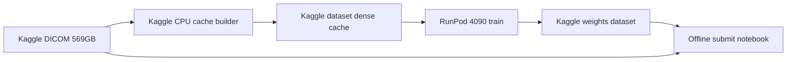

# Top-10 plan for RSNA Knee Abnormality Detection

## Can this reach top 5? (honest read, 23 Sep 2026)

Short answer: on the **main** board, probably not with $300 and 4 weeks from where the repo is today. It is not impossible, but it should be treated as a stretch, not the plan's success criterion.

- A recent [CLIST snapshot](https://clist.by/standings/rsna-knee-abnormality-detection-medicine-computer-vision-image-text-image-classification-roc-auc-score-69383566/) shows about **10 teams at 0.96** and ranks 11-30 at **0.95** (rounded to 2 decimals, so the real gaps are in the 3rd decimal). Top 5 means beating teams that are already there and still submitting daily.
- A public notebook ([rsna-base](https://www.kaggle.com/code/anvithpothula/rsna-base)) scores **0.936** in under 3 minutes from public datasets and weights. Anyone can start there, so 0.936 is the floor of the crowd, not an edge.
- The repo's current recipe is **~0.59** on the 58 expert studies. Rebuilding the public recipe from scratch (the original days 1-8) spends a third of the time just reaching what is free to fork.
- The public board is **~30% of test** (about 390 studies). Rare labels (Fracture, Baker's) have few positives there, so the 0.95-0.96 cluster will reshuffle on private. That helps a strong team that did not overfit the public board, but it also means top 5 is partly luck even with a 0.96 model.
- MLEvolve and Dream-RSI make search cheaper and stop the agent from repeating the kill ledger. Neither creates the extra ~0.025 AUC that top 5 needs. That has to come from better supervision or better geometry, which is what the loop is pointed at below.

Realistic outcomes on this budget: public **0.945-0.955** is achievable if the label work pays off (roughly a medal, somewhere in the top 30-60). Top 10 needs about 0.958+. Top 5 needs about 0.962+ and a good private draw.

**Where top 5 is more reachable: the efficiency track.** It pays 3 prizes and ranks by `AUC / (benchmark - maxAUC) + runtime/32400`. A single fast model near the top AUC with a runtime of a few minutes scores well, and most 0.96 teams are running heavier ensembles. The plan keeps Final B aimed at this.

## Changes from the first version of this plan

1. **Start from the public 0.936 floor on day 1**, instead of rebuilding the dense cache and first model. Public Kaggle datasets and weights are allowed (public, free). Check each input's license before relying on it, because winners must open-source everything.
2. **Pre-registered go/no-go on 6 Oct:** if public LB is below **0.950**, stop chasing main-board rank. Spend the remaining budget on robustness (seeds, fold averaging) and the efficiency final.
3. **Money moves from rebuilding to labels.** The crowd shares the same corpus and weights, so the separating lever is supervision: better multilingual report-distilled soft labels trained on the public corpus geometry.
4. **Finals are chosen for private-board robustness**, not the single best public score (see Final A below).

Deadline is **22 Oct 2026** (~4 weeks). Metric is macro ROC AUC over 12 labels. Reports exist only in training. Submit via an offline Kaggle notebook (`submission.csv`, GPU or CPU, under 9 hours). Up to **5 submits/day**, **2 finals**. External data must be public and free; registration-gated sets (MRNet, OAI) stay out until hosts say otherwise. Own trained weights ship as a Kaggle dataset attached to the notebook.

## Why the current recipe cannot place

The live recipe in [docs/STATUS.md](https://github.com/Girish011/RSNA_Knee_Abnormality_Detection_Model/blob/main/docs/STATUS.md) is frozen DINOv2-S on **3 series x 12 slices x 224**, trained on keyword weak labels. Seed-averaged expert OOF on 58 studies is **0.617** (single-seed mean **0.592 ± 0.021**). Public single models are already **~0.93–0.94**.

That gap is not “another encoder on the same thin cache.” Measured public results (dreaddevelopment corpus notes and [single-model thread](https://www.kaggle.com/competitions/rsna-knee-abnormality-detection/discussion/735304)):

- One CoAtNet at 384, **80 slices / 78 windows**, scores **0.932** with no ensemble.
- Spreading the same slice count thinner drops score; density (~1.2% of the stack per slice) is the lever. Window count on the **same weights** moved **0.926 → 0.932**.
- Three different backbones blended gained about **+0.001**. Data geometry moved **0.006–0.011**.
- A separate single model hit **0.942 at 224px**. 224 is enough if the volume is dense.
- Hidden test is expert-read images. Train labels are noisy multilingual reports. Fitting the teacher harder does not fit the exam (already shown: weak-val rose while gold peaked at epoch 4 in `gf_v0c`).

Kills in [docs/DECISIONS.md](https://github.com/Girish011/RSNA_Knee_Abnormality_Detection_Model/blob/main/docs/DECISIONS.md) apply to the **thin** recipe only: longer training, unfreeze, 12→24 slices, 224→336, Med-Men gap-fill, expert head fine-tune. [docs/RANK1_ROADMAP.md](https://github.com/Girish011/RSNA_Knee_Abnormality_Detection_Model/blob/main/docs/RANK1_ROADMAP.md) is stale (it still treats 0.72 and unfreeze as the path). The agent must obey the Sep 2026 kill ledger, not that roadmap.

The in-flight MRI-CORE run on `cache_gf_v0` is another encoder swap on the thin cache. Log it when it finishes. Do not block the new corpus on it.

## Money and machines ($300 hard cap)

Do not train on Kaggle GPUs. Weekly cooldown makes an autonomous loop stall. Do not copy 569 GB to the cloud.

- **Cache and label audit:** Kaggle CPU notebooks (free, 9h sessions, chain them). Raw DICOM stays mounted on Kaggle.
- **Train:** one [RunPod Community RTX 4090 24 GB](https://llmhosting.ai/vs/runpod-vs-vast) at about **$0.34/hr**. More predictable than Vast’s $0.14–0.27 marketplace hosts, which is what an unattended loop needs. Shut the GPU down whenever the LLM is planning. Checkpoint every epoch to a network volume so a preemption restarts from disk.
- **Fallback GPU:** RTX 3090 ~$0.22/hr if 4090 is queued. Do not rent A100/H100.
- **Agent LLM:** DeepSeek or Qwen API for the coder; a stronger model only for the planner. Cap **~$50**.
- **GPU cash:** **~$230**, which is ~600 hours on paper. Real use should be **~120–200 hours** (about 4–7 full trains plus smokes). The rest is retry buffer. A full 5-fold on a dense 224 corpus should be on the order of **$25–40** if the GPU is not left idle.
- **Storage:** a ~80 GB RunPod volume for the JPEG/uint8 cache plus checkpoints. Delete the cloud cache after weights are back on Kaggle.

Inference must read **test DICOM inside the submit notebook** with the same slice picker. The train cache is not available at test time.

## What the agent is allowed to search

MLEvolve ([paper](https://arxiv.org/html/2606.06473v1), [repo](https://github.com/InternScience/MLEvolve)) is a progressive Monte Carlo graph search with retrospective memory and a planner/coder split. Dropping it unmodified onto raw MRI will burn the budget on install failures and banned levers. Use the mechanisms, with a **typed genome** and a hard ban list.

Dream-RSI ([paper](https://arxiv.org/html/2609.14858v1), [repo](https://github.com/zhengkid/Dream-RSI)) is the cost control. A finished experiment tree is a replay world: alternative policies can be scored from stored logits with no new training. On this budget, most “ideas” must be dreams.

**Online nodes (GPU, rare):** new weights. A node is one config hash: sampler, soft-label mix, backbone from a short menu, head, loss, epoch count.

**Dream nodes (free, default):** window count, plane mix, checkpoint epoch, per-label head pick, rank-mean blend, calibration. These read saved per-window logits. Dream-RSI’s replay score is adapted to dollars: best proxy AUC minus a GPU-hour penalty, plus a small bonus for batching dreams instead of launching trains.

**Banned, written into memory so the planner cannot propose them:** reports or any text model at test time; private or registration-gated pretraining; unfreeze on a noisy teacher; keyword gap-fills judged by a single 58-study macro; “train longer” once gold has peaked while weak-val is still rising; ensembles of many backbones; thin 3x12 as a continuing baseline; optimizing the 58-gold macro for deltas under ~0.04.

**Cold-start knowledge base** (MLEvolve retrospective memory, static half) is seeded from [docs/DECISIONS.md](https://github.com/Girish011/RSNA_Knee_Abnormality_Detection_Model/blob/main/docs/DECISIONS.md), the tail of [docs/experiments.md](https://github.com/Girish011/RSNA_Knee_Abnormality_Detection_Model/blob/main/docs/experiments.md), and the public density notes above. Dynamic half stores plan, metric, error, and whether the node was a dream or a train. Retrieval is stage-aware: planner sees wins and kills; debugger sees stack traces.

**Search operators** (MLEvolve expansion types), only after a real baseline exists:

- Primary: one-module diff (coding mode defaults to diff, not full rewrite).
- Intra-branch: last few attempts on the same corpus, reflect what moved proxy AUC.
- Cross-branch: only after 2 failed trains on a branch.
- Aggregation: fuse two elites (for example dense geometry from branch A and label mix from branch B) as a new root.
- Progressive schedule: first week is one baseline, not broad UCT. Later steps may branch only if the dream policy says the expected proxy gain beats one GPU-day.

**Dataset-specific harness pieces** (not in either paper, required here):

- **Ruler stack.** Proxy macro AUC vs held-out report soft labels (large n, their weak ruler sd was 0.0085). Expert-58 is a **veto** for collapses and for effects above the measured seed noise (~0.02–0.04), not the search objective. Public LB is a calibration event, budget **4 submits** total, only when proxy and a smoke gold check agree. After each LB point, the dream policy refits which proxy tracks the board. This is the only way a 58-study ruler can steer toward 0.94.
- **Per-label reliability gate** before any train, reusing [src/rsna_knee/text/fill_policy.py](https://github.com/Girish011/RSNA_Knee_Abnormality_Detection_Model/blob/main/src/rsna_knee/text/fill_policy.py). A label column enters the loss only if precision on the 58 experts is at least 0.5. MCL already failed this. Soft labels, not hard keyword fills.
- **Paired credit.** A child counts as an improvement only if seed, fold split, and corpus hash match the parent (the pairing property that made `gf_v0c` interpretable). Reward is MLEvolve-style: fail / valid-no-gain / new branch best, but “best” is proxy AUC, not 58-gold.
- **Geometry mutations first.** If a branch stalls, the next operator changes span, spacing, or window count. Backbone swaps are last.

## Modeling target (the first train, hand-specified)

The first GPU job is not searched. It is the public recipe, implemented in this repo so later diffs are small.

- **Corpus:** per study, sagittal + coronal + axial (fat-suppressed / fluid-sensitive treated as one flag; they are identical on all 24,371 series in the public fold dataset). Dense uniform indices over a mid span (start near 6–94% of each series, spacing near 1.2% of stack depth, on the order of 60–80 slices total, not 36). uint8 JPEG or npz. Study-grouped folds, reuse the grouped-CV idea already in [src/rsna_knee/data/folds.py](https://github.com/Girish011/RSNA_Knee_Abnormality_Detection_Model/blob/main/src/rsna_knee/data/folds.py).
- **Labels:** multilingual soft targets. Keep expert override on the 58. Build with the existing text stack ([src/rsna_knee/text/](https://github.com/Girish011/RSNA_Knee_Abnormality_Detection_Model/tree/main/src/rsna_knee/text)) plus a constrained JSON pass (Qwen already listed in [docs/EXTERNAL_ASSETS.md](https://github.com/Girish011/RSNA_Knee_Abnormality_Detection_Model/blob/main/docs/EXTERNAL_ASSETS.md)). French-heavy reports were the known hole in keyword v1. Gate per label on the 58 **before** training. Train with soft BCE or ASL; do not hard-threshold.
- **Model:** public DINOv2 ViT-B/14 or a ConvNeXt/CoAtNet-class 2D net, **224 first** (a public 0.942 exists at 224; 384 is a later dream-justified retrain only if 224 plateaus under ~0.90 LB). 2.5D windows (3 neighboring slices as channels) or slice tokens with a **label-aware pool**. There is already a label-query model in [src/rsna_knee/models/label_query.py](https://github.com/Girish011/RSNA_Knee_Abnormality_Detection_Model/blob/main/src/rsna_knee/models/label_query.py) and pooling in [src/rsna_knee/models/pooling.py](https://github.com/Girish011/RSNA_Knee_Abnormality_Detection_Model/blob/main/src/rsna_knee/models/pooling.py). Frozen backbone for the first run. Loss: asymmetric or soft BCE plus a small pairwise ranking term, per-label weights from prevalence, in [src/rsna_knee/training/loss.py](https://github.com/Girish011/RSNA_Knee_Abnormality_Detection_Model/blob/main/src/rsna_knee/training/loss.py).
- **What to save:** per-window logits, not only study probabilities, so window count and blends are dreams. Also per-epoch OOF via the existing [src/rsna_knee/epoch_policies.py](https://github.com/Girish011/RSNA_Knee_Abnormality_Detection_Model/blob/main/src/rsna_knee/epoch_policies.py).
- **Success gate for this baseline:** proxy clearly above the thin-cache weak OOF (~0.69), and one public LB submit. **Target: LB above 0.90.** If it misses, the next online node fixes corpus or labels, not the backbone.

## Two finals from one model

- **Final A (main):** best blend that still finishes in 9 hours on ~1,300 studies, chosen by agreement of the report-label proxy and public LB, not public LB alone. Prefer multiple seeds or folds of one backbone plus the public weights over a zoo; averaging is what survives a 30%/70% public/private split.
- **Final B (efficiency, the realistic top-5 shot):** same weights, fewest windows that keep AUC within ~0.003 of Final A. Efficiency score is `AUC / (benchmark - maxAUC) + runtime/32400` (lower is better). The public floor already runs in about 3 minutes, so runtime is only a small part of the score; AUC dominates. Dream the window count on a timed smoke (`notebooks/89_benchmark_offline.py` style). Do not run a separate distillation research track inside $300.

## Four-week schedule

**Days 1–2, $0 GPU.** Fork [rsna-base](https://www.kaggle.com/code/anvithpothula/rsna-base) and its inputs (Max-Span Dense Corpus, twelve-findings weights, DINO v2). Check licenses. Submit once to confirm ~0.936 and record the runtime. This is the floor every later node must beat. Download the public corpus to RunPod with the Kaggle API instead of building our own cache. Only build a cache on Kaggle CPU if the corpus license or format blocks training.

**Days 2–4, $0 GPU.** Add the `agent/` harness (journal graph, ban list, dream replay, RunPod runner). Encode kills into `agent/memory/cold_start.md`. Build the multilingual soft labels and audit them on the 58 with [scripts/audit_weak_labels.py](https://github.com/Girish011/RSNA_Knee_Abnormality_Detection_Model/blob/main/scripts/audit_weak_labels.py). Update STATUS so the next session does not resume thin-cache A/Bs.

**Days 5–13, first own train and the go/no-go.** Train on the public corpus geometry with our soft labels, same backbone class as the public weights, so the only change is supervision. Save per-window logits. Dream window count, epoch pick, and a rank-mean blend with the public weights. **LB submits 1–2.**

**6 Oct gate (pre-registered).** Public LB at or above **0.950**: keep pushing the main board with at most ~3 more trains (geometry, then label-column gate, then loss/pool). Below 0.950: stop main-board search. Spend what is left on seeds and fold averaging for private robustness, and on the efficiency final.

**Days 14–22.** Agent loop as above: dream first, train only on a planner diff that names one module and a pre-registered proxy delta. Up to ~2 LB submits per day are affordable now (5/day cap), but each one must be a calibration of the proxy, not a public-board hill-climb.

**Days 23–29, package.** Upload weights. Offline notebook: no internet, reads test DICOM, writes `submission.csv`, logs runtime. Smoke on the 3-study public test, then a full commit. Select the two finals. Leave a short method note in `docs/` for the 5 Nov winners’ write-up (code link, public weights, video) so a top-10 finish is not lost on paperwork.

## Risks

- A 58-study gold number will keep lying about 0.01 changes. The loop ignores it except as a veto.
- If the dense cache is built with the wrong series picker, the first train fails and eats ~$40. Days 1–3 include a dry-run on a few dozen studies and a visual/label sanity check before the 4090 is started.
- RunPod community can preempt. Epoch checkpoints are mandatory.
- The top band moved from ~0.93 to ~0.96 within weeks and will keep rising to 22 Oct. Top 5 on the main board is a stretch goal. The plan's success bar is a medal-range main final plus a competitive efficiency final.
- The public corpus and weights are what every team forks, so they cannot be the edge. If our own soft labels do not beat the public labels on the proxy by the 6 Oct gate, there is no cheap lever left to reach the top 10.
- Leaderboard numbers above come from a rounded third-party snapshot. Re-check the live Kaggle leaderboard on day 1 and reset the gate if the band has moved.
