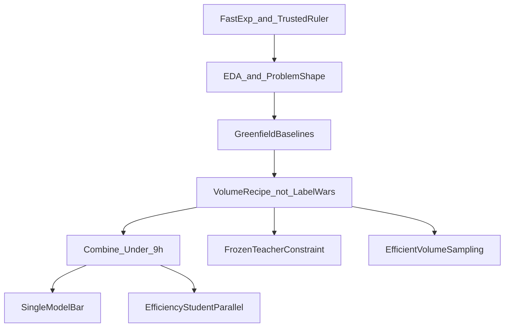

# RSNA Imaging Playbook Portfolio (Post 1 + Monorepo)

Copied from Cursor plan `rsna_playbook_blog_03c9cd7c.plan.md` (original planning chat: [RSNA playbook blog](2f85a2a6-3123-4438-a9a3-8f8399ce38f5), 2026-09-05).

## Source material we will mirror

- [The Kaggle Grandmasters Playbook](https://developer.nvidia.com/blog/the-kaggle-grandmasters-playbook-7-battle-tested-modeling-techniques-for-tabular-data/): two foundations (fast experiments + trustworthy validation) + 7 techniques.
- [Winning with Generative AI–Assisted Coding](https://developer.nvidia.com/blog/winning-a-kaggle-competition-with-generative-ai-assisted-coding/): 4-step human-in-the-loop agent loop (EDA → baselines → improve → combine), always saving OOF/preds, summarizing experiments with agents.

We keep their **system** (fast iteration + trusted rulers + agent-accelerated code), not their tabular recipes. Post 1 is the series manifesto for a **from-scratch** [RSNA Knee Abnormality Detection](https://www.kaggle.com/competitions/rsna-knee-abnormality-detection) campaign.

## Public tone (locked)

- **Public blog / Pages / README:** technical competition writeups — problem framing, rulers, methods, planned experiments. Same register as NVIDIA Grandmaster posts.
- **Internal only:** career / learning motivations. Never in posts or site copy.

## Series stance: greenfield, informed by prior probes (locked)

Those numbers (public ~0.682, gold ~0.7023, leaders ~0.94, kill table) came from **prior participation**. They are **not** “where our series continues from.”

| Use prior records as | Do not use them as |
|---|---|
| Kill ledger / anti-patterns | Adopted baseline to ship |
| Design constraints (“don’t waste cycles here”) | Campaign scoreboard of ownership |
| Proof that label micro-tuning and thin caches plateau | Proof we should 5-fold the same stack |
| Ruler calibration (weak-val overstates; gold noise) | Final claims or “we are at 0.68” narrative |

**Public framing:** we are planning and executing a new pipeline from scratch. Prior probes tell us what failed and why the remaining gap is likely **image volume / representation under a noisy teacher**, not another label CSV.

Existing monorepo code may be reused as scaffolding (DICOM paths, metrics, notebook layout) but the **architecture and experiment plan are redesigned**, not “resume v6c.”

## Idea: more efficient redesign thesis (default for the series)

Prior work showed: bigger / unfrozen DINOv2, naive richer cache, expert head-FT, external KneeMRI, and plane+pos_weight routing did not close the gap; label micro-tuning is exhausted; CPU multi-fold submit timed out.

**Default thesis for Posts 2+ (subject to measurement):**

1. **Freeze the teacher problem as a constraint, not the main lever.** Reuse a single frozen weak-label recipe (or the best already-built CSV) without reopening keyword/LLM fill wars. Audit once against full-58 gold precision; then stop.
2. **Make the MRI the product.** Replace uniform `3×12×224` with an **efficiency-aware volume recipe**: plane-budgeted sampling (more sag slices for ligaments/menisci; cor/ax budgets for OA/fluid/bone), decode-once paths designed for hidden-test submit from day one, target runtime headroom under 9h before any 5-fold.
3. **Single strong study encoder before ensembles.** One backbone + aggregator that sees ordered multi-slice context (2.5D / short temporal Transformer / slice-attention), trained frozen-then-lightly-adapted only if freeze wins. No 5-model hill-climb until a single model clears a much higher gold bar than the old ~0.70 plateau.
4. **Build the efficiency student in parallel.** Distill the main encoder early so dual finals are not an afterthought; shared cache, different heads/depth.
5. **Rulers stay:** full-58 gold macro (margin 0.005) to keep/kill; public LB only to calibrate; never ship on weak-val alone.

This is the series’ technical through-line. Post 1 states the thesis; later posts implement and measure it.

## Repo decision (locked)

**One public monorepo:** reuse [`Girish011/RSNA_Knee_Abnormality_Detection_Model`](https://github.com/Girish011/RSNA_Knee_Abnormality_Detection_Model) (already at `/Users/girish11/RSNA_Knee_Abnormality_Detection_Model`).

| Area | Role |
|---|---|
| `src/`, `notebooks/`, `configs/`, `scripts/`, `tests/` | Competition code — refactor toward new architecture over time |
| `docs/STATUS.md`, `DECISIONS.md`, `experiments.md` | Engineering memory; reset STATUS to greenfield plan after Post 1 ships |
| `site/` (new) | Portfolio blog for GitHub Pages |

Ensure the GitHub repo visibility is **public**. Pages from `/site` via GitHub Actions (Markdown → simple HTML + CSS).

**Commit policy:** stage and show diffs; **commit / push / Pages enable only after your explicit OK.**

## Tabular playbook → imaging playbook (series map)



| Deotte (tabular) | Our imaging remapping | Future post |
|---|---|---|
| Core: fast exp + local CV | Kaggle loop + **full-58 gold macro** ruler | Post 1 |
| Agent Step 1: EDA | Study/series/planes; multilingual reports teaser; domain shift | Post 1 + Post 2 |
| Agent Step 2: baselines | **New** slim baselines (not “resume frozen DINOv2-B v6c”) | Post 3 |
| §3 Feature engineering | Efficiency-aware volume / sampling recipe | Post 4 |
| §6 Pseudo-labeling | Frozen teacher + precision gate (no micro-tuning saga) | Post 5 |
| §4–5 Hill climb / stack | Only after single-model bar; submit-safe runtime | Post 6 |
| §7 Extra training | Multi-seed / full-data after ruler wins | Post 7 |
| Agent Step 4: combine | Max-AUC final + efficiency student built in parallel | Post 8 |

## Post 1 content outline (professional technical tone)

Title working draft: **An Imaging Playbook for RSNA Knee Abnormality Detection**

Sections:

1. **Series framing** — Grandmasters Playbook + agent-assisted loop applied to a multimodal code competition; cite both NVIDIA posts as method references.
2. **What the problem actually is** — 12-label macro AUC; images + series metadata at test; reports train-only; scale; ≤9h offline submit; dual finals.
3. **The two exams problem** — noisy report teachers vs expert-graded images; measurement trap table (as **rulers to use**, not our live scores).
   - **Multilingual teacher (brief):** FR/TR/ES/DE/EL/NL/EN + negation example; deep recipes deferred.
4. **Foundations remapped** — fast experimentation under GPU quota; full-58 gold macro keep/kill; weak-val is smoke only.
5. **Four-step agent workflow** — EDA → baselines → improve → combine; agents write code; rulers decide what ships; always save OOF/preds.
6. **Constraints from prior probes (kill ledger)** — short table of what already failed (unfreeze collapse, cache_v2 regress, expert FT, external MRI shift, label fill coin-flips, thin 3×12 cache ceiling, CPU 5-fold timeout). Phrase as **inputs to a new design**, not “our current LB.” Optional footnote: approximate public/gold deltas only as ruler calibration, not a claim of standing.
7. **Greenfield thesis** — freeze teacher; redesign volume + study encoder; single-model bar before ensembles; efficiency student in parallel; submit path first-class.
8. **Series roadmap** — seven techniques remapped to upcoming posts (what we will build next).
9. **Attribution** — NVIDIA posts; competition page; disclaimer that prior probe numbers are historical constraints, not this series’ published standing.

**Do not include** a “Where the campaign stands: adopted v6c / public 0.682 / gold 0.7023” section as if we are continuing that stack.

## Site / portfolio scaffolding

```text
site/
  index.html
  css/style.css
  posts/
    01-imaging-playbook.md
  about.md
.github/workflows/pages.yml
```

`site/index.html`: series list, competition link, greenfield technical intro, links to code. No learning-path copy.

## Code side for Post 1 (light)

- README points to Pages + Post 1; states series is a from-scratch plan informed by prior kill ledger.
- Optional CSV-only audit figures under `site/assets/`.
- No secrets, tokens, caches, or weights.
- No requirement to retrain or submit for Post 1.

## Execution order (after you approve the plan)

1. Confirm repo is public; add `site/` + Pages workflow (files only; no commit until you say so).
2. Draft Post 1 from the greenfield outline; you review tone and kill-ledger wording.
3. Wire index + CSS; local preview.
4. Show `git status` / diff; **wait for commit permission**.
5. On approval: commit, push, enable Pages; return live URL.
6. Stop. Next chunk: Post 2 EDA + start greenfield baseline plan (not v6c resume).

## Out of scope for this first delivery

- Resuming or publishing the old stack as the solution.
- New label wars or S01b 5-fold of the old recipe.
- Claiming leaderboard standing we do not have under the new plan.
- Separate blog-only repo (rejected).
