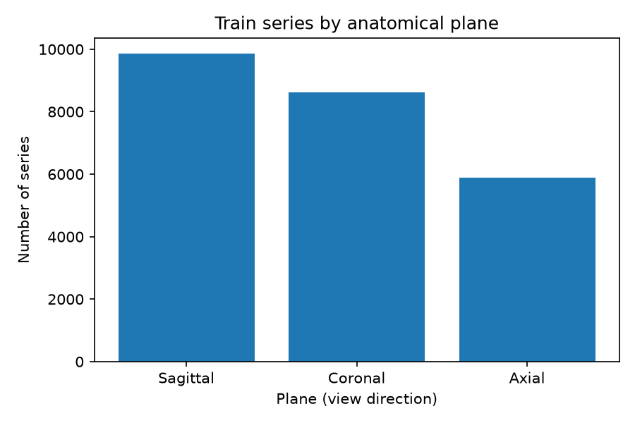
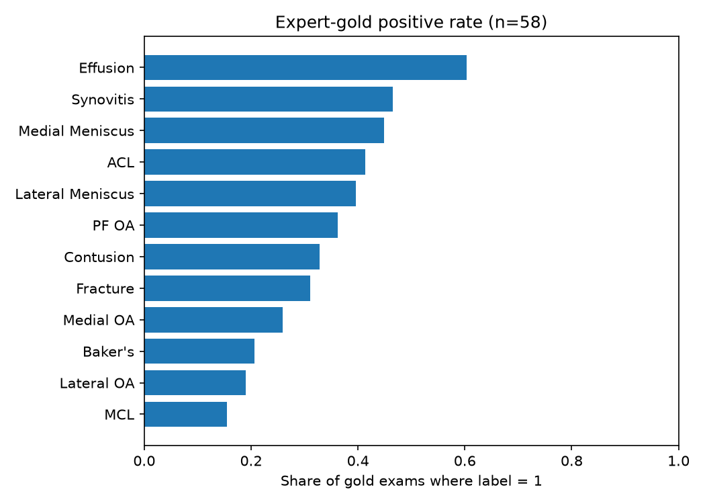

# Looking Carefully at the Knee MRI Data (EDA)

This is Post 02 of the [RSNA Knee Imaging Playbook](../index.html). **RSNA** is the Radiological Society of North America. The contest is [RSNA Knee Abnormality Detection](https://www.kaggle.com/competitions/rsna-knee-abnormality-detection).

**EDA** means exploratory data analysis: looking carefully at the data *before* building a model. Here we only use the public **CSV** tables (comma-separated values: spreadsheet-like text files). We do not open the huge **DICOM** image folders yet (DICOM is the hospital scan file format).

All numbers below come from `notebooks/01_data_audits.py` run on local copies of `train.csv` and `train_series.csv`.

---

## What one exam looks like

In this contest, one training row is not one photo. It is one **study**: one scanning visit for one knee, identified by `StudyInstanceUID`.

Each study contains several **series** (scan sequences). Each series has:

- a plane (view direction)
- flags for fluid-sensitive imaging and fat suppression

| Fact | Value from our audit |
|---|---|
| Train studies | 4,407 |
| Train series | 24,371 |
| Series per study | min 3, mean 5.53, max 14 |
| Expert-gold studies | 58 (1.32% of train) |

So a typical exam is about five to six sequences, not one image. Any model that keeps only a tiny fixed crop of the exam is throwing most of the visit away on purpose.

---

## Planes (view directions)

**Plane** = which way the scanner cuts through the knee:

- **Sagittal** = side view
- **Coronal** = front view
- **Axial** = top-down view



| Plane | Series count | Share of all series |
|---|---|---|
| Sagittal | 9,864 | 40.5% |
| Coronal | 8,609 | 35.3% |
| Axial | 5,898 | 24.2% |

More important than the mix: **every** train study has at least one Sagittal, one Coronal, and one Axial series (4,407 / 4,407 for each). So “hard labels” such as **ACL** (anterior cruciate ligament) are not failing because the side-view plane is missing from the metadata.

---

## Fluid-sensitive and fat-suppression flags

Two columns appear on every series row:

- **Fluid_Sensitive**: sequence that makes fluid stand out
- **Fat_Suppression**: technique that darkens fat so other tissue is clearer

In this training CSV they are **always paired**:

- both 0 on 10,361 series
- both 1 on 14,010 series
- never one without the other

For modeling, treat them as one combined style flag in this dataset, not as two independent switches.

---

## The 58 expert-gold exams

Only **58** training studies have all 12 labels filled by experts (~1.32% of train). Everyone else has empty label cells in `train.csv` and must be supervised later from reports (or left unused for supervised training).



Positive rate means: share of those 58 exams where the label is 1 (finding present). Examples from the chart:

- **Effusion** (extra joint fluid) is common in gold
- **ACL** is about **41%** positive in gold
- rarer labels such as **MCL** (medial collateral ligament) and fracture sit much lower

That ACL rate is a warning. Host and prior notes say report-based ACL rates in the wider corpus are closer to ~20%. The gold 58 are **not** a mini copy of “average” training exams. Use them as a ranking yardstick (full-58 **macro AUC**), not as a normal sample for probability calibration. **AUC** means area under the ROC curve (a ranking score); **macro** means average the 12 label AUCs.

Host rule reminder: borderline / “on the fence” findings are graded **negative** (prefer fewer false alarms).

---

## Train vs test (what we did not audit yet)

This post audited **train** metadata only.

| Split | What we have in this audit |
|---|---|
| Train | Full `train.csv` + `train_series.csv` |
| Public test CSV | Not used here; in the contest it is basically a tiny placeholder |
| Hidden test | About 1,300 exams: images + series info, **no radiology reports** |

So any system that needs report text at test time cannot ship. Labels from reports can only help **training**.

We also did not run language detection on the `Report` column in this step. Multilingual reports (French, Turkish, and others) remain a Post 05 topic.

---

## What this means for the greenfield plan

1. **Structure is rich.** Every exam has all three planes and several series. A thin fixed cache such as “3 series × 12 slices” is a severe downsample, not a full exam reader.
2. **ACL difficulty is not “missing sagittal.”** The side-view plane is present for every train study in metadata.
3. **Expert labels are rare and skewed.** Lock a careful keep/kill rule on full-58 macro AUC; do not overfit tiny label edits to these 58 rows.
4. **Next coding lever is sampling.** Post 03 / 04: build a first model path and an efficiency-aware plan for *which* series and slices to keep under the 9-hour submit limit.

---

## How to reproduce

```bash
# from the repo root, with pandas + matplotlib installed
python notebooks/01_data_audits.py
```

Outputs:

- `outputs/eda/step_a_summary.txt`
- `site/assets/eda_planes.png`
- `site/assets/eda_gold_rates.png`

Code lives in the public monorepo: [RSNA_Knee_Abnormality_Detection_Model](https://github.com/Girish011/RSNA_Knee_Abnormality_Detection_Model).

---

## Attribution

Series context: [Post 01: An Imaging Playbook for RSNA Knee Abnormality Detection](01-imaging-playbook.html).

Competition: [RSNA Knee Abnormality Detection](https://www.kaggle.com/competitions/rsna-knee-abnormality-detection).

Method habit (look before you model): [The Kaggle Grandmasters Playbook](https://developer.nvidia.com/blog/the-kaggle-grandmasters-playbook-7-battle-tested-modeling-techniques-for-tabular-data/).
