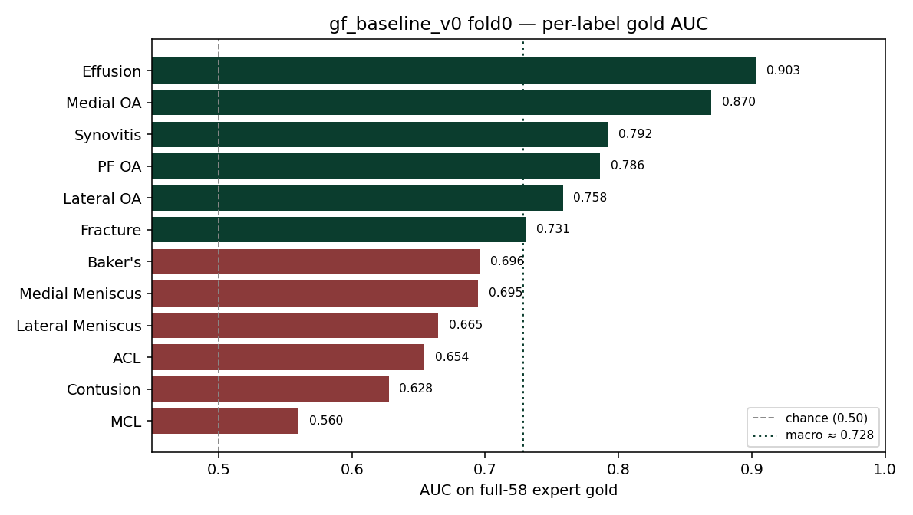

# First Simple Models from Scratch

This is Post 03 of the [RSNA Knee Imaging Playbook](../index.html). **RSNA** is the Radiological Society of North America. The contest is [RSNA Knee Abnormality Detection](https://www.kaggle.com/competitions/rsna-knee-abnormality-detection).

After [Post 02](02-eda-problem-shape.html) mapped the exam shape, we built a **greenfield** baseline: a new image path from scratch, not a restart of older thin-cache trials. The goal was not a leaderboard climb. It was a working train → cache → score loop with an honest keep-or-kill ruler.

---

## What “simple” means here

**MRI** means magnetic resonance imaging (hospital soft-tissue scans). One contest row is one **study** (one scanning visit), not one photo. Each study has several **series** (scan sequences) in different **planes** (view directions: sagittal / side, coronal / front, axial / top-down).

Our first model, `gf_baseline_v0`, keeps only a small fixed crop of each exam:

| Choice | Setting |
|---|---|
| Series | 1 Sagittal + 1 Coronal + 1 Axial (prefer fluid-sensitive) |
| Slices per series | 12, center-biased |
| Image size | 224 × 224 |
| Backbone | **DINOv2-S** (`dinov2_vits14`), frozen for all 5 epochs |
| Teacher labels | temporary keyword weak set (`weak_labels_v1.csv`) |
| Fold | fold 0 only (train 1,953 / val 496 studies with any weak label) |
| Loss | masked binary cross-entropy; `pos_weight = 1.0` |

**DINOv2** is a public vision transformer pretrained by Meta. **Frozen** means the backbone weights stay fixed; only a small prediction head learns. That keeps the first run cheap and stable.

This is deliberately thin. Post 02 already showed every train study has all three planes and often five or more series. A 3×12×224 cache throws most of the visit away on purpose so we can measure a floor.

Config: `configs/gf_baseline_v0.yaml`. Cache Dataset: `girishbose/rsna-knee-cache-gf-v0` (4,407 studies). Training ran on Kaggle GPU kernel `girishbose/gf-baseline-v0-fold0` with machine shape `NvidiaTeslaT4`.

---

## Two scores, one ruler

**AUC** means area under the ROC curve (how well the model ranks true cases above false ones). **Macro AUC** averages the 12 label AUCs.

| Yardstick | What it is | How we use it |
|---|---|---|
| Weak-val macro AUC | Score on fold-0 validation using report-derived weak labels | Smoke check only |
| Full-58 gold macro AUC | Score on all 58 expert-labeled train studies | **Ship ruler** (keep/kill margin 0.005) |

Weak labels and expert gold are different jobs. Weak-val can look tidy while gold (and later the public **LB**, leaderboard) tell a harsher story. We do not ship on weak-val alone. We also do not probe the public LB until a fuller **OOF** (out-of-fold: predictions on held-out folds) win clears this gold floor.

Host rule we keep in view: the submit notebook sees **images + series metadata only**. Radiology reports may help build training labels later. They must never be required at test time. Gated assets such as KneeCoT stay off the table.

---

## Results (fold 0, Save Version)

Persisted run (kernel Save Version → Dataset `girishbose/rsna-knee-gf-v0-fold0`):

| Metric | Value |
|---|---|
| Weak-val best macro AUC | **0.718** (epoch 4) |
| Full-58 gold macro AUC | **0.728** |
| Gold labels defined | all 12 |

Weak-val by epoch on that run: 0.657 → 0.677 → 0.710 → 0.713 → **0.718**.

An earlier interactive session hit weak-val ≈ 0.742, but those weights were not saved. `/kaggle/working` does not survive a new session. Treat 0.718 / 0.728 as the official v0 numbers. Also: that interactive run and the Save Version did not share a fixed random seed, so the gap is not a clean ablation.

| Label | Gold AUC |
|---|---|
| Effusion | 0.903 |
| Medial OA | 0.870 |
| Synovitis | 0.792 |
| PF OA | 0.786 |
| Lateral OA | 0.758 |
| Fracture | 0.731 |
| Baker's | 0.696 |
| Medial Meniscus | 0.695 |
| Lateral Meniscus | 0.665 |
| ACL | 0.654 |
| Contusion | 0.628 |
| MCL | 0.560 |

**OA** means osteoarthritis. **ACL** / **MCL** are the anterior and medial collateral ligaments. **PF** means patellofemoral.

Pattern: fluid and OA-style labels already rank well. Ligament and trauma-style labels (MCL, Contusion, ACL) sit near the floor. That matches the Post 02 warning that hard labels are not “missing sagittal in the CSV.” The thin volume is a likelier bottleneck than plane coverage in metadata.

---

## What this run proved

1. **The greenfield loop works end to end.** Series picks → resized cache → frozen DINOv2 head → weak smoke → full-58 gold score, with artifacts published as Kaggle Datasets.
2. **A tiny exam crop already beats chance on gold.** Macro ≈ 0.728 on all 58 experts is a usable floor, not a finish line (public leaders sit near ~0.94).
3. **Weak-val is not the ship score.** Official weak-val (0.718) and gold (0.728) sit close here; that will not always be true. Keep the ruler on gold.
4. **Persist or it did not happen.** Interactive peaks without Save Version / Dataset publish are anecdotes.

What it did **not** prove: that 3×12×224 is enough; that frozen-S is the final backbone; that weak_v1 is the final teacher; or that fold 0 alone predicts public LB.

---

## Next levers (for Post 04)

Two honest axes from here:

1. **Volume iterate** (series count, slices, resolution, careful unfreeze): attack image signal, especially ACL / MCL / Contusion.
2. **Multi-fold same recipe**: turn fold 0 into a full OOF gold read before any public LB probe.

We will pick one axis next and measure against this gold floor with the 0.005 margin. No public submit until an OOF win.

---

## Artifacts

| Item | Slug / path |
|---|---|
| Config | `configs/gf_baseline_v0.yaml` |
| Cache | `girishbose/rsna-knee-cache-gf-v0` |
| Code + labels meta | `girishbose/rsna-knee-gf-v0-meta` |
| Fold0 checkpoint + gold metrics | `girishbose/rsna-knee-gf-v0-fold0` |
| Train + gold kernel | `girishbose/gf-baseline-v0-fold0` |

Code lives in the public monorepo: [RSNA_Knee_Abnormality_Detection_Model](https://github.com/Girish011/RSNA_Knee_Abnormality_Detection_Model).

---

## Attribution

Series context: [Post 01](01-imaging-playbook.html) · [Post 02](02-eda-problem-shape.html).

Competition: [RSNA Knee Abnormality Detection](https://www.kaggle.com/competitions/rsna-knee-abnormality-detection).

Backbone: [DINOv2](https://github.com/facebookresearch/dinov2) (Meta; public weights).

Method habit (local score before scoreboard): [The Kaggle Grandmasters Playbook](https://developer.nvidia.com/blog/the-kaggle-grandmasters-playbook-7-battle-tested-modeling-techniques-for-tabular-data/).
